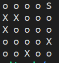
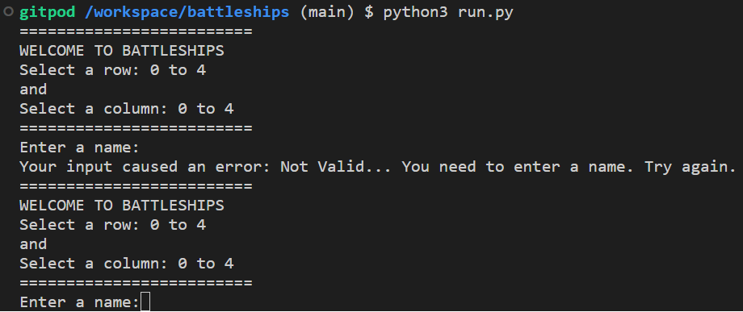

# Battleship Game Created for Python Project.

## Table of Contents.

* [User Experience](#user-experience)
	- [Lucid Chaft](#lucidchart)
* [Data Model](#data-model)
	- [Lucid Chart]
     - [Random Module](#random-module)
* [Game Features](#game-features)
* [Testing](testing.md)
* [Clone Website](#clone-website)
* [Deployment](#deployment)
* [Technologies](#technologies)
 

# Data Model.
## Lucid Chart.
## Random Module.
Imported for use in this website was __randomint__ from the random module provided as use within the website from external source. 
[Python Random Module](https://www.w3schools.com/python/module_random.asp) for reference.

# Game Features.

## HIT. 
Method for showing a hit on a Battleship in combat with a "*" on the game board and a HIT statment. 

## MISSED AND BATTLESHIP LOCATION. 
Method for showing a miss on a Battleship in combat with a "X" on the game board and a MISSED statment. 
Method for showing the Battleship's location is with an "S" on the game board. 

## LOCATION ALREADY TRIED. 
If the row and column selected shows on the game board as an "X" already. Then this feature prompts you, it can not place an "X" on thre board, as you have already tried that guess of row and column combination. 
You then get prompted that you have lost a turn to find the Battleship. 
 
I used assitance for the code to correct what I had written. I did try two different methods but could not quite get it to work for this instances. 
First try. Within an IF statement. 
 
Second try. I tried to append lists of the guesses given by the player. 
 
End Result from code. See [RtoDto.net.](https://rtodto.net/a-simple-battleship-python-script/) in credit also. 
It still has been adapted from the original code source. 
Look of the code in its final state for this website. 

## END OF GAME. 
At the end of 5 turns, the Battleship is revealed to the user as an "S" on the game board. With a statement saying the Battleship was to hard to find - GAME OVER.  
Even though you can now see the Battleship on the game board, the co-ordinates of the row and column numbers, are revealed too. 

## NAME 
The player of the game can enter their name. That data is used to show them which board is theirs to play on, showing any hits, misses or the batttleship.

## GUESS ROW AND COLUMN. 
There is a prompt created for the player to guess a row and column value to try and find the battleship on the board. 
An error prompt shows, and the player can put in another valid input for their row and column guesses.

# Trial and errors. 
## APPENDING LISTS 
Tried using Append() method to add a HIT or MISS to the Battleship Board but it was not working correctly. Which lead to it just being added to the list and not changing the current "o" character. 

## READING ROW AND COLUMN OUT OR RANGE. 
The selection for a range integer between was between 0 - 4. The code written did not cover this value so it was raising an error. One was needed as a row value and the other as a value for column in the grid for the Battleship game. 
**Code -** This would register any number between -1 to 6. Which I did not want.  
**random_row = randint(0, len(board))** 
**random_column = randint(0, len(board[0]))**  
 
This was corrected in the code. 
**Corrected code -** This code registered at the 0-4 range I needed 
**random_row = randint(1, len(board)) - 1** 
**random_column = randint(1, len(board[0])) - 1** 

## NO INPUT 
If no input for the name is added. It will show as an error.
Used and adapted code from the Love Sandwiches Coursework for validating name input. 
This can be numbers, letters or special characters. 
For example: Player1 or Bobby. Even @Bobby_BattleShip-game! 
https://p3-battleships.herokuapp.com/ 

# Credits.
1. [Codecadmey](https://www.codecademy.com/courses/learn-python/lessons/battleship/exercises/welcome-to-battleship). Building the battleship game code on this website provided.
 

2. [Love Sandwiches Coursework.](https://p3-battleships.herokuapp.com/) Validating name. 

3. [RtoDto.net.](https://rtodto.net/a-simple-battleship-python-script/) 
Assist with getting a working statment so if the board game was already marked with a 'miss - "X"', then the game would ask you for another row and column choice.

4. [Python Random Module](https://www.w3schools.com/python/module_random.asp) for reference.

# Technologies
[Python Random Module](https://www.w3schools.com/python/module_random.asp) has been used to import a libary of data to use when needing random integers for this website. It helped to create a position for the batlleship in the Battleship game.