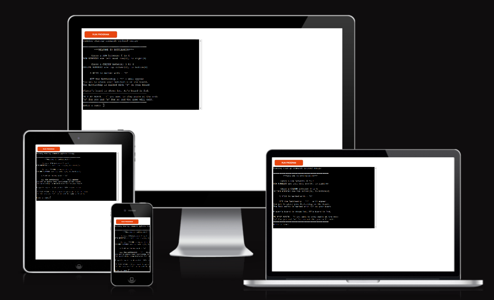
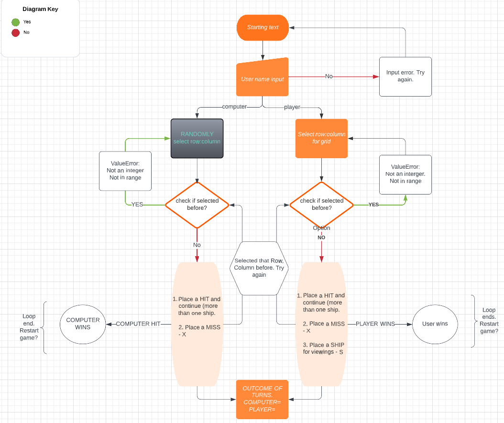
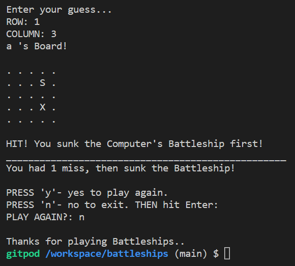
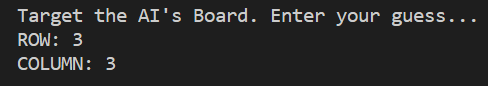
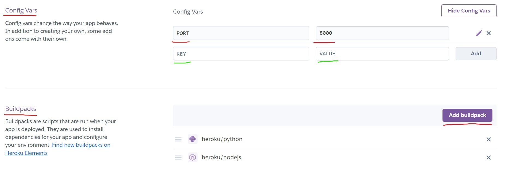
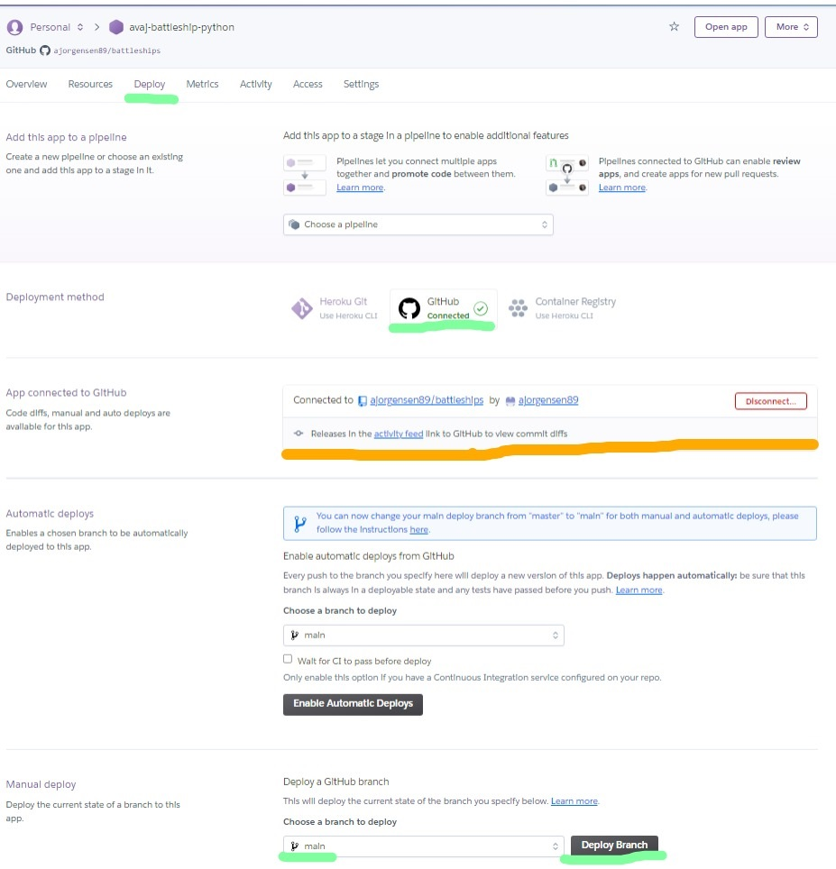
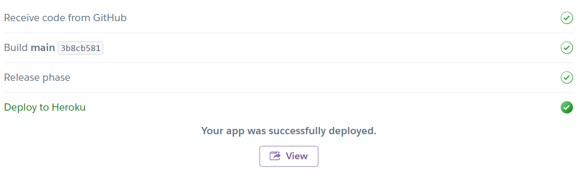
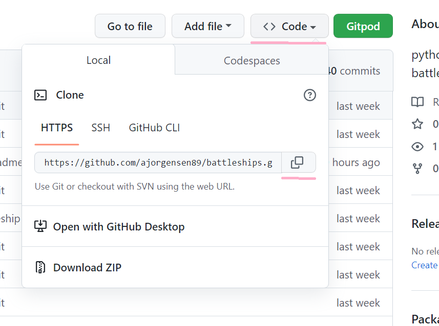
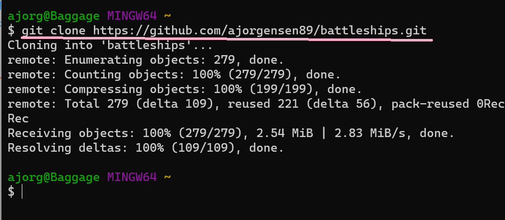

# Battleship Game Created for Python Project.
 

[Deployable Link to Project site.](https://avaj-battleship-python.herokuapp.com/) 

 

 
 
This Python Coded project is based on a long running game called Battlehships. The essence of this game is played with two players. 
It can be played one vs computer on many different platforms or advanced into a multiplayer game on a computer or on a boardgame. 
Each player, which can include an Artificial Intelligence(AI), has a Battleship which they place on a board, for the other player to find and sink. 
The way to find and sink the Battleship is by taking it in turns to guess a Row and a Column to make a co-ordinate on that board. 
If the players combined row and column guessed co-ordinate, is correct, the Battleship is found. 
The first player to sink the Battleship is the winner. 
The oringal boardgame Battleships also offers different size ships, so you have to hit a combination of points on the board before the Battleship sinks. 
The Battleship can also be part of a larger fleet, meaning you and your opponent have more Battleships to sink before winning. 

## Table of Contents.

* [User Experience](#user-experience)
* [Flow Chart](#flow-chart)
	- [Lucid Chart](#lucid-chart)
* [Game Features](#game-features)
* [Trial and Errors](#trial-and-errors)
* [Testing](testing.md)
* [Clone Website](#clone-website)
* [Credits](#credits)
* [Technologies](#technologies)
     - [Module](#module)
* [Deployment](#deployment)
* [Credits](#credits)
* [Awknowledgements](#awknowledgements)
 

# User Experience
Unlike previous projects, the design has been tested on a number of different technolgies such as Chorme developer tools and Lighthouse to check performance, design, appearance and other objectives such as responsiveness. Most of these tests have not be carried out on this [Python](https://www.python.org/) coded website. 
Changes can be added, such as text colour to improve the User Experience. 
This website is a Command Line Based [Python](https://www.python.org/) project.
 
Changes have been made since making this flow chart, to the end project itself.
 
A user may or not want to place their own Battleship, but this option has been added for more interaction. 
The command lines are spaced out to improve readability. 
Instructions, within a welcome message, has been added to provide diraction for the user. 
Error message prompts are added to inform the user of any errors faced while playing. 
A _'Run Program'_ button is at the top of the screen for the user to reload the program if necessary 
The project used the _Module_ _random_, _randint_, could be used for businesses that need random logic, such as gaming or lottery websites. A range is provided to control the _randomness_ of the numbers. This can be adpated to different numbers or picking out the _odd_ numbers only, from a random array. 

### Steps
Some steps and ideas to take when building this project. 
 

### Business logic.

The project shows methods of taking data such as user input and applying it within different parts of the code. 
The project can handle data and store that within a function for use on the website. 
The project will prompt a user if an entry is _important_ and something has to be entered at a particular point. 
the project shows handling "string" data input.
The project also shows validating integers and number input from a user. It can be changed from a "string format" to "integer format". This could be used for aspects such as entering stock number, age values or years worked. 
The turn counter could be used and applied in an increasing format or decreasing format, if needed to count down, instead of up. Such as, tracking stock, depending on input. 
The project can also change data that is currently entered. 
It can be run again, to repeat entry of another item. 
Items can be entered into an empty list. 
For this game, the data entered changes a point on the board. It can change an entry listed item. 
If a certain critria is met, the code can exit early if complete. 
If something has already been filled out and stored, it can prompt the user. It does not have to overight certain options, if not wanted. 
It has the ability to manipulate lists of different sizes of data. Even though one method, a 5x5 list is shown within this project. 
Lists can be manuplited, patterns of 'lists' being created, can be removed or changed to a different character. 

## Responsive Design.
[Ai I responsive?](https://ui.dev/amiresponsive) was used to check its look on a number of different devices and responsiveness. The text should be instructive but not too long, that viewing becomes difficult on mobile devices. 
 

# Flow Chart.
## Lucid Chart.
I used [Lucid Chart](https://www.lucidchart.com/pages/) to create a flow chart of how to create a battleship game.
1. Start - welcome message
2. User name input - raises an error if no input is submitted and loops untill there is input.
3. Select Battleship position (Not on chart - added later.)
4. Select Row:Column for grid - Select the numbers between 0-4 for both row and column. The input should be validated if guessed before or invalid. You would have to try again.
5. Check if used before. Re-select.
6. Loop untill AI or user wins.
7. Option to restart game or exit.
 
 

[Back to the top](#battleship-game-created-for-python-project)

# Game Features.

## Hit. 

Method for showing a hit on a Battleship in combat with a "*" on the game board and a HIT statement. 
 

## Missed and battleship location. 

Method for showing a miss on a Battleship in combat with a "X" on the game board and a MISSED statement. 
Method for showing the Battleship's location is with an "S" on the game board. 
 

## Location already tried. 

If the row and column selected shows on the game board as an "X" already. Then this feature prompts you, it can not place an "X" on the board, as you have already tried that guess of row and column combination. 
A prompted is given to show you have tried that row and column combination already and to try again. 
 
I used assitance for the code to correct what I had written. I did try two different methods but could not quite get it to work for this instances. 
First try. Within an IF statement. 
 
Second try. I tried to append lists of the guesses given by the player. 
 
End Result from code. See [RtoDto.net.](https://rtodto.net/a-simple-battleship-python-script/) in credit also. 
It has been adapted from the original code source. 
Look of the code in its final state for this website. 
 
Now that the location on the 'list' used for our board had been idenified accuractely, if the idenified part of the 'list' had been changed to an "X" characater already, it would ask you to enter your input again.

## End of game. 

Once the player or AI has won - GAME OVER. 
Misses have been counted and shown at the end. 
After finishing a game, the option is given the the user to continue or exit by selecting 'y' (yes) or 'n' (no) on the keyboard followed by the **Enter** key.
 

 

## Name 

The player of the game can enter their name. That data is used to show them which board is theirs to play on, showing any misses or the batttleship.  
No input will appear with an error and the user will have to ensure they enter something as their 'name'. 
The name provided is stored in a variable to be applied for use later in the project.
The method _.strip()_ has been used to removed any unwanted whitespace on name entering. 
See [Testing](testing.md) for more details in **No input for name**. 

The AI's board is also distinguished with a title. 
 

## Guess row and column.  

There is a prompt created for the player to guess a row and column value to try and find the battleship on the board. 
An error prompt shows, and the player can put in another valid input for their row and column guesses. 
This needs a valid integer as an input within the range, using the _.range()_ method, of 0 - 4. This provides me with _ROW - 0, 1, 2, 3, 4_ _COLUMN - 0, 1, 2, 3, 4_.
See [Testing](testing.md) for more details in **Validating inputs**. 
Prompt for guessing a Row and Column. 
 

## Placing Battleships 

The user is prompt to place their own Battleship, as you would when playing a boardgame. You would pick where on the grid it should go. 
 

## Turn counter 

Depending on who wins, the winner can see how many turns it took to HIT their opponents Battleship. 
 

## Validating input. 

Validating input became abit of trail and error in itself, to find the best approach, for creating code to test that certain input was valid. It is an important feature to this website to ensure the player or an AI can play correctly without crashing the game. 
For the 'name', it checked the **input** entry was not empty before continuing with the next part of the code. 
The **input** for validating entry for certain prompts needed to checked differently. It needed to be an integer, aswell as, being an integer form a particular range. 
The range for this website, was the size of the boardgame (0 - 4) and specified in the instrctions to play. See above in _Guess row and column_ for range details. 
If the placement of a Battleship or, a guessed row or colum entry was an integer, it still needed to be within a range to play the game and make enteries on the boards provided. 
To see how this was tested click to view the [Testing](testing.md) file here. 

## Restart game. 

The option to restart or exit the game is given at the end of the game once someone has won. 

[Back to the top](#battleship-game-created-for-python-project) 

## Future Features. 

Added features to this game could be to play a friend rather than an AI. Even have more than one player and make it a mulitplayer 'human' game. 

A bigger fleet of ships would give more User Experience. If for example, five ships had to be found before a winner was declared. 

Also, the grid size could to be adjusted to play on a bigger grid (10 x 10), or even a smaller grid (3x3). 

Larger ships could be placed on the grid also, consisting of more than one grid space, making you have to hit a number of different points on one ship to sink it fully. For example, a long ship could take up row:0, column:1, row:0, column:2 and row:0, column:3. 

Instead of just a tally counter for turns, the users could be given a certain amount of ammunition to hit the ships. Ending the game when the ammunition run out and revealing who sunk the most Battleships. 

[Back to the top](#battleship-game-created-for-python-project)

# Trial and errors.  

### APPENDING LISTS 
Tried using Append() method to add a HIT or MISS to the Battleship Board but it was not working correctly. Which lead to it just being added to the list and not changing the current "o" character signifying grid points at this point. 
 
This was later corrected and characters on the board were changed accordingly, depending on a ship, hit or miss. This can be seen in pictures throughout the README.md file. 

### WRONG RANDOM NUMBER GENERATED. 
The selection for a range integer is between 0 - 4. The code written did not cover this value so it was raising an error. 
This would register any number between -1 to 6. Which I did not want.  
**Incorrect code -**
**Code - ai_ship_row = randint(0, len(ai_board))** 
**Code - ai_ship_col = randint(0, len(ai_board[0]))**   
 

This was corrected in the code. 
**Corrected code -** 
**Code - ai_ship_row = randint(1, len(ai_board)) - 1** 
**Code - ai_ship_col = randint(1, len(ai_board[0])) - 1** 
This code registered at the 0-4 range I needed 

## Known Error. 
To restart the game, the function is not fool proof. It accepts the input of 'y' for yes and continues with a game, it also accepts 'n' for no and exits the game. However, on entry of an incorrect value, the game restarts. 
Exiting the game will only work if 'n' or 'N' is entered. 
For a new player to enter their name, the 'Run Program' button would have to be used. 

[Back to the top](#battleship-game-created-for-python-project) 

# Deployment
To deploy for a [Python](https://www.python.org/) language coded website, [Heroku](https://dashboard.heroku.com/), a cloud based platform was used.
Follow the steps for deployment method. 
1. If needed, sign in and register to Heroku website first. _Click_ on **New** in the top right corner to create a new application.  
 

2. Add an application name. Follow the rules of what you can enter. Select a region, and _click_ **Create App**. 
 
3. Next stage will be a few changes on this page below. First, click into **Settings**.
 
4. Once in **Settings**, Config Vars need adding. Change the _KEY and VALUE_ headings. In this case to _PORT and 8000_. Other files such as _creds.json_ file would be added here. 
Now add buildpacks. _Click_ buildpack to choose. It this instance, two, python and nodejs where added. They can be rearranged and deleted if needed here. 
**Important - python needs to be on top**.  
 
5. Now _click_ into **Deploy**. This wesbite was connected to **Github**. Which can be selected at the top. The **orange line**, shows the location to connect your repository from **Github** to **Heroku**. _Enter_ the name of the repository you need and connect. This pictures shows the repository already connected via **Github**. _Scroll_ to the bottom of the page to deploy. Select **main branch** and _click_ **Deploy Branch**. 
 
6. The website may show as _building_ for a while. Once it has completed, it should look like the images below, with a **view** link. _Click_ here to view your website. 

## Clone website.
To clone the project. I _clicked_ **code** in the respository file. In the dropdown menu, **copy** the link. 
Here, on the image below,  the locations are highlighted in **pink**. 
 
Once cloned, **open** an IDE such as **GitBash**, to clone your wesbite. _Type_ **git clone** followed by your copied **URL link**. Hit enter.
 

[Back to the top](#battleship-game-created-for-python-project) 

# Technologies

## [Python](https://www.python.org/)
This project has been coded in [Python](https://www.python.org/) language.

## Module.
Imported for use in this website was __randomint__ from the random module provided as use within the website from external source. 
[Python Random Module](https://www.w3schools.com/python/module_random.asp) has been used to import a libary of data to use when needing random integers for this website. It helped to create a random position for the batlleship in the Battleship game. 

## Python Tutor.
[Python Tutor](https://pythontutor.com/visualize.html). Helps to test, run and visualize parts of code.

## Heroku.
[Heroku](https://dashboard.heroku.com/) is a cloud based platform used to deploy the application on.

## Github.
[Github](https://github.com/) was used to edit and build the website using [Python](https://www.python.org/) code.

## Broswer combatability.
Checked the websites combatability with the following browers:
1. Apple Safari.
2. Google Chrome.
3. Opera Browser.
4. Microsoft Edge. 

Ran the website with no significant issues. 

See [Testing](testing.md) file for full use of technologies used to test this wesbite. 

[Back to the top](#battleship-game-created-for-python-project)

# Credits.

1. [Codecadmey](https://www.codecademy.com/courses/learn-python/lessons/battleship/exercises/welcome-to-battleship). I ran through and completed this example of building the battleship game code on this website provided. It had useful prompts and helped improve my understanding to create the code for the website. 

2. [Love Sandwiches Coursework.](https://p3-battleships.herokuapp.com/) for validating input and providing an example python project through [Code Institute](https://codeinstitute.net/). 

3. [RtoDto.net.](https://rtodto.net/a-simple-battleship-python-script/). Better handling.

4. [Stack Overflow](https://stackoverflow.com/questions/41718538/how-do-i-insert-a-restart-game-option) restart game tips. Adapted to suit this website.

5. [101 Computing](https://www.101computing.net/number-only/) Supplied example of validating input. Adapted to suit what it was needed for. 

[Back to the top](#battleship-game-created-for-python-project)

# Awknowledgements.
To the **Tutor Support** team for [Code Institute](https://codeinstitute.net/) for continued support and assitance. 
To mentor **Precious Ijege** for continued support and patience while taking part in the course provided by [Code Institute](https://codeinstitute.net/) for a Diploma in Full Stack Software Development. 
To the Love Sandwiches 'Example project' for Python code supplied by Anna Greaves, Content Developer for [Code Institute](https://codeinstitute.net/). 

[Back to the top](#battleship-game-created-for-python-project)

