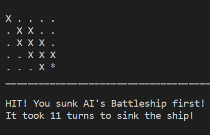

Codecadmey. Building the game
https://www.codecademy.com/courses/learn-python/lessons/battleship/exercises/welcome-to-battleship

Love Sandwiches Coursework. Validating name.
https://p3-battleships.herokuapp.com/

Trial and Errors. 
Tried using Append() method to add a HIT or MISS to the Battleship Board but it was not working correctly. Which lead to it just being added to the list and not changing the current "o" character. 

READING ROW AND COLUMN OUT OR RANGE.
The selection for an integer between was between 0 - 4. The code written did not cover this value so it was raising an error.  

This was corrected in the code.

HIT. 
Method for showing a hit on a Battleship in combat. 

# Create empty list to store the game's board.
board = []
computer = []

from collections import Counter
list = [1, 2, 3, 4]
ob = Counter(list)
items = ob.items()
for i in items:
     print(i)
 
