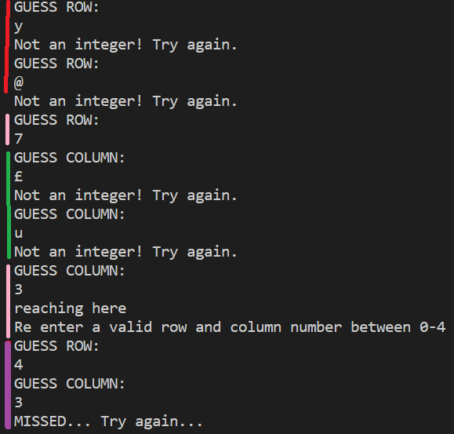
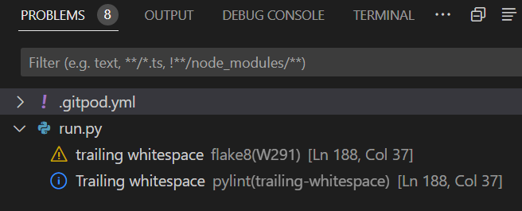

# Testing.

## Validating Inputs.
As seen in [Game Features](#game-features), the player enters a name, guesses rows and columns and also gets to place their Battleship on the board. The AI also places a Battlehship and takes it in turns to guess rows and columns of the players Battleship position. 
All of this needs checking so the game does not inadvertently stop due to these errors. They are written into the [Python](https://www.python.org/) code for the website to handle the errors better for greater User Experience. 
Here is the example of developing code to deal with **data input** 
This images shows the development of **IF statements**. The two if statements underlined in green are combined into one more readable statement that takes up alot less lines. 
However, once this was created I found inconsistent errors in my code. See below in [Inconsistnet error](#inconsistent-error) 
 

To fix these inconsistencies, the code needed improving. The code needed to check the integers range, was added to the function that checked the **input** was an integer itself. The functions would then check the **input** was an integer **and** within the specified range **before** continuing with the code or looping again. 
Before developing the validating input functions, the code was place into a **while loop** to loop untill a correct integer was entered but the statements inside the function were too many. 
Here is the examplem below. 
 
This image below shows it printing when in error. 
 

Here is an example of a the functions that checks **input**.
It checks the **input** is an integer and then whether it is within a particular range before exiting the function. This function will then catch the errors created by user input rather than crashing the game. 
The code underlined with __red__ ensures an integer is entered. 
The code underlined with __green__ checks the range, starting from number 0 and accepting five numbers - 0, 1, 2, 3 and 4 as valid input. 
 
This image below shows the function working if something that it not an integer is entered. 

### NO INPUT FOR NAME 
If no input for the name is added. It will show as an error.
Used and adapted code from the Love Sandwiches Coursework for validating name input. 
This can be numbers, letters or special characters. 
For example: Player1 or Bobby. Even @Bobby_BattleShip-game! 
https://p3-battleships.herokuapp.com/ 

### Inconsistent error.
A number of different errors occurred when trying to create statements to check if the numbers being entered where within a particular range. In this instance, between 0 and 4.
Here are some examples of inputting different numbers but the outcome would be erratic. 
The example below shows 7 being selected for GUESS ROW and 2 being selected for GUESS COLUMN, at two different intervals. Both examples have been marked with blue lines. 
The inconsistency was with the **Error** management. When entered the second time, at the bottom of the picture, the error message was created and printed but in the first try in this picture, the program stops due to this issue, rather than printing the **Error** that had been developed for this wesbite with the [Python](https://www.python.org/) code. 
 
This was improved upon as you find in [Game Features](#game-features) with _validating input_ functions rather than _if statements_.
 
Demonstrated through [101 Computing](https://www.101computing.net/number-only/), the example helped with a layout for checking the input from a user much better. This was used and adapted to improve and remove these inconsistent errors. 

## PROBLEM TOOL in GITHUB. 
This tool is avaliable for use through [Github](https://github.com/). I assisted with checking issues with the code straight away.
Here is one example, but it could inform you of unused variables and a number of different errors in the code written.

# [Pylint](https://pylint.org/)

[Pylint](https://pylint.org/) tool was used to validate my [Python](https://www.python.org/) code. It ensured that code being created conformed to certain rules. 
It helps with the user experience and understanding. 
It ensured code devlopment followed certain rules. Suggested Fixes occured when checking pylint.  
One was the use of **col** as a variable name, used when creating the board game's grid. It was not used or unpacked for use again in any instance and [Pylint](https://pylint.org/) raised it as a concern under __Unused Variable__. 
 

To fix this, single underscore **'_'** for a variable name was used.  
Variable was not used again in this instance. Only for creating the layout of the board itself. It could be used as 'row'.

I had to ensure [Pylint](https://pylint.org/) tool was installed on my computer for use. 

## [Python Tutor](https://pythontutor.com/visualize.html)
[Python Tutor](https://pythontutor.com/visualize.html) helps you to visulize the code being created. Whether it a loop, or fucntion to test. It really helped to visualize when creating parts of code.

## [PEP Validator](https://www.pythonchecker.com/)

Passed my code through [PEP Validator](https://www.pythonchecker.com/) and no significant errors arose.

## [Code institue PEP Validator](https://pep8ci.herokuapp.com/)
This was provided to me by my Mentor through the [Code Institute](https://codeinstitute.net/) Course as an additional Linter.
No issues arose to be corrected. 

